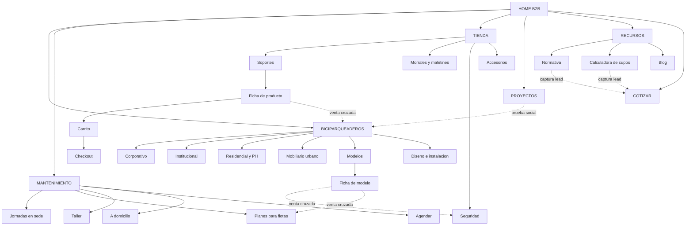

# Arquitectura de información — Soluciones de Movilidad

Fuente de verdad de la estructura del sitio. Cualquier página nueva debe encajar aquí.

---

## 1. Árbol de páginas

```
HOME B2B (/)
│
├── BICIPARQUEADEROS (/biciparqueaderos)
│   ├── Corporativo (/biciparqueaderos/corporativo)
│   ├── Institucional y educativo (/biciparqueaderos/institucional)
│   ├── Residencial y PH (/biciparqueaderos/residencial)
│   ├── Mobiliario urbano (/biciparqueaderos/mobiliario-urbano)
│   ├── Modelos (/biciparqueaderos/modelos)
│   │   └── Ficha de modelo (/biciparqueaderos/modelos/{slug})
│   └── Diseño e instalación (/biciparqueaderos/diseno-instalacion)
│
├── MANTENIMIENTO (/mantenimiento)
│   ├── Jornadas en sede (/mantenimiento/jornadas-empresariales)
│   ├── Planes para flotas (/mantenimiento/flotas)
│   ├── Taller (/mantenimiento/taller)
│   ├── A domicilio (/mantenimiento/domicilio)
│   ├── Planes y precios (/mantenimiento/planes)
│   ├── Cobertura (/mantenimiento/cobertura)
│   └── Agendar (/mantenimiento/agendar)
│       └── Confirmación (/mantenimiento/agendar/confirmado)
│
├── PROYECTOS (/proyectos)
│   └── Caso de estudio (/proyectos/{cliente})
│
├── RECURSOS (/recursos)
│   ├── Normativa: Ley 1811, PESV y POT (/recursos/normativa)
│   ├── Calculadora de cupos (/recursos/calculadora-cupos)
│   ├── Fichas técnicas (/recursos/fichas-tecnicas)
│   ├── Preguntas frecuentes (/recursos/faq)
│   └── Blog (/blog) → (/blog/{slug})
│
├── NOSOTROS (/nosotros)
│   └── Aliados y certificaciones (/nosotros/aliados)
│
├── COTIZAR (/cotizar) → (/gracias)
│
└── TIENDA — subsitio con header propio (/tienda)
    ├── Soportes para bicicleta (/tienda/soportes)
    ├── Morrales y maletines (/tienda/morrales-maletines)
    ├── Seguridad: guayas y candados (/tienda/seguridad)
    ├── Accesorios (/tienda/accesorios)
    ├── Ofertas (/tienda/ofertas)
    ├── Ficha de producto (/tienda/{categoria}/{producto})
    ├── Buscador (/tienda/buscar)
    ├── Carrito (/tienda/carrito)
    ├── Checkout (/tienda/checkout) → (/tienda/pedido-confirmado)
    ├── Compra por volumen (/tienda/corporativo)
    ├── Envíos y entregas (/tienda/envios)
    ├── Cambios y devoluciones (/tienda/devoluciones)
    ├── Garantía (/tienda/garantia)
    └── Mi cuenta (/mi-cuenta)
        ├── Mis pedidos (/mi-cuenta/pedidos)
        ├── Detalle y rastreo (/mi-cuenta/pedidos/{id})
        └── Direcciones (/mi-cuenta/direcciones)

CAPA TRANSVERSAL (fuera del menú, se entra desde home y pie)
├── Para empresas (/soluciones/empresas)
├── Para constructoras y arquitectos (/soluciones/constructoras)
├── Para conjuntos residenciales (/soluciones/conjuntos)
└── Para universidades (/soluciones/universidades)
```

---

## 2. Sitemap visual



Las líneas punteadas son el negocio real: quien compra un biciparqueadero necesita candados y
mantenimiento, y quien compra una guaya puede necesitar un biciparqueadero en su edificio.

---

## 3. Mapa de URLs

| Página | URL | Ubicación en nav | Prioridad | Intención |
|---|---|---|---|---|
| Home | `/` | Header | Alta | Orientar en 5 s |
| Biciparqueaderos | `/biciparqueaderos` | Header | Alta | Cotizar proyecto |
| Corporativo | `/biciparqueaderos/corporativo` | Mega menú | Alta | Cotizar |
| Institucional | `/biciparqueaderos/institucional` | Mega menú | Media | Cotizar |
| Residencial y PH | `/biciparqueaderos/residencial` | Mega menú | Media | Cotizar |
| Mobiliario urbano | `/biciparqueaderos/mobiliario-urbano` | Mega menú | Media | Cotizar |
| Modelos | `/biciparqueaderos/modelos` | Mega menú | Alta | Comparar |
| Ficha de modelo | `/biciparqueaderos/modelos/{slug}` | Interna | Media | Cotizar / descargar ficha |
| Mantenimiento | `/mantenimiento` | Header | Alta | Agendar |
| Jornadas en sede | `/mantenimiento/jornadas-empresariales` | Mega menú | Alta | Cotizar jornada |
| Planes para flotas | `/mantenimiento/flotas` | Mega menú | Alta | Cotizar plan |
| Taller | `/mantenimiento/taller` | Mega menú | Media | Agendar |
| A domicilio | `/mantenimiento/domicilio` | Mega menú | Media | Agendar |
| Agendar | `/mantenimiento/agendar` | CTA | Alta | Convertir |
| Tienda | `/tienda` | Barra superior + bloque home | Alta | Comprar |
| Categoría | `/tienda/{categoria}` | Mega menú tienda | Alta | Comprar |
| Ficha de producto | `/tienda/{categoria}/{producto}` | Interna | Alta | Comprar |
| Compra por volumen | `/tienda/corporativo` | Mega menú tienda | Media | Cotizar |
| Proyectos | `/proyectos` | Header | Media | Generar confianza |
| Caso de estudio | `/proyectos/{cliente}` | Interna | Media | Confianza + cotizar |
| Normativa | `/recursos/normativa` | Mega menú | Alta (SEO) | Captar lead |
| Calculadora de cupos | `/recursos/calculadora-cupos` | Mega menú + home | Alta | Captar y calificar |
| Fichas técnicas | `/recursos/fichas-tecnicas` | Mega menú | Media | Captar correo |
| Blog | `/blog/{slug}` | Mega menú | Media | Tráfico |
| Nosotros | `/nosotros` | Header | Baja | Confianza |
| Cotizar | `/cotizar` | CTA header | Alta | Convertir |
| Landings por segmento | `/soluciones/{segmento}` | Home + pie | Alta | Calificar y convertir |

**Reglas de URL:** minúsculas, guiones, sin fechas, sin IDs, sin tildes ni ñ, política única de
barra final. Toda URL antigua del cliente se redirige con 301.

---

## 4. Navegación en dos contextos

### Contexto A — Sitio corporativo (todo excepto `/tienda/*`)

**Barra superior delgada (32 px):**

```
Bogotá · Cobertura nacional ——————— ¿Eres biciusuario? Ir a la tienda →
```

**Header principal (fijo al hacer scroll):**

```
[LOGO]  Biciparqueaderos ▾   Mantenimiento ▾   Proyectos   Recursos ▾   Nosotros   [COTIZAR EN 24 H]
```

5 ítems más el CTA. La tienda no va en este header: al lado de "Biciparqueaderos" le diría al
gerente de sostenibilidad que le vendemos morrales.

**Mega menús, máximo 3 columnas, cada columna cierra con una acción:**

| Biciparqueaderos ▾ | Mantenimiento ▾ | Recursos ▾ |
|---|---|---|
| **Por sector**<br>Corporativo<br>Institucional y educativo<br>Residencial y PH<br>Mobiliario urbano | **Empresas**<br>Jornadas en sede<br>Planes para flotas | Normativa Ley 1811 y PESV<br>Calculadora de cupos<br>Fichas técnicas |
| **Explorar**<br>Ver todos los modelos<br>Diseño e instalación | **Personas**<br>Taller<br>A domicilio<br>Planes y precios | Preguntas frecuentes<br>Blog |
| → Calculadora de cupos | → Agendar ahora | → Hablar con un ingeniero |

### Contexto B — Dentro de la tienda (`/tienda/*`)

El header cambia por completo al entrar:

```
[LOGO] ← Volver al sitio | Soportes ▾  Morrales ▾  Seguridad ▾  Accesorios  Ofertas  [🔍] [👤] [🛒 2]
```

- Buscador visible siempre en escritorio, no escondido tras una lupa
- Carrito con contador y mini-preview al agregar. Nunca redirigir al carrito: mata la compra múltiple
- Barra superior fija con el umbral de envío gratis
- Botón de regreso al sitio para que el visitante B2B no se pierda

### Pie de página (4 columnas + barra legal)

- **Líneas**: Biciparqueaderos · Mantenimiento · Tienda
- **Soluciones**: Empresas · Constructoras · Conjuntos · Universidades
- **Recursos**: Normativa · Calculadora · Fichas técnicas · FAQ · Blog
- **Empresa**: Nosotros · Aliados y certificaciones · Contacto · Trabaja con nosotros
- **Legal**: Términos · Privacidad · Política de tratamiento de datos · Envíos y devoluciones

### Migas de pan

Obligatorias desde el nivel 2, espejo exacto de la URL, todos los segmentos clicables menos el
actual. Ejemplo: `Inicio > Tienda > Morrales y maletines > Morral impermeable 25L`.

### Móvil

- Menú hamburguesa en acordeón, no dropdown anidado
- Barra inferior fija con 3 acciones: **Cotizar · WhatsApp · Carrito**
- Filtros de tienda como panel deslizante a pantalla completa, no acordeón largo

---

## 5. Orden de bloques de la home (B2B)

1. Hero: dato duro + promesa + CTA `Cotizar` / CTA secundario `Calcular cupos`
2. Barra de logos de clientes
3. Selector de sector: 4 tarjetas hacia `/soluciones/*`
4. **Línea 1 · Biciparqueaderos** (bloque grande, doble peso visual)
5. Caso destacado con 3 métricas duras
6. Bloque normativo: Ley 1811, PESV, POT → `/recursos/normativa`
7. **Línea 2 · Mantenimiento** (bloque medio, 3 modalidades, CTA `Agendar`)
8. **Línea 3 · Tienda** (bloque medio, 4 productos con precio → `/tienda`)
9. Cómo trabajamos, en 4 pasos
10. Aliados y certificaciones
11. CTA final con formulario de 5 campos

---

## 6. Plantillas (base de la escalabilidad)

### Plantilla A — Hub de línea
Encabezado con el dolor de la línea + CTA · selector de sector o categoría (3-4 tarjetas) ·
cómo funciona en 3-4 pasos · logos y caso destacado con cifras · bloque de venta cruzada a las
otras líneas · FAQ de la línea · CTA de cierre.

### Plantilla B — Ficha de modelo o producto
Galería · nombre y código · capacidad de cupos o specs · material y acabados · dimensiones ·
normativa que cumple · ficha técnica PDF descargable (captura correo) · precio o cotizar ·
relacionados · servicio de instalación o mantenimiento asociado.

### Plantilla C — Servicio agendable
Qué incluye · para quién · comparativo de planes en tabla · tiempos · cobertura geográfica ·
agendador embebido · FAQ.

### Plantilla D — Caso de estudio
Cliente y sector · reto · solución instalada · 3 métricas duras (cupos, m² recuperados, %
de adopción) · fotos antes y después · testimonio · productos usados con enlace a ficha ·
CTA "quiero algo así".

**Al agregar una línea nueva:** un hub con Plantilla A y sus hijos. Nada más se toca.

---

## 7. Flujo de agendamiento de mantenimiento

```
/mantenimiento/agendar

PASO 1 — ¿Dónde necesitas el servicio?
   ┌──────────────────┬──────────────────┬──────────────────┐
   │ En mi empresa    │ En su taller     │ En mi casa       │
   │ (jornada)        │                  │ (domicilio)      │
   └────────┬─────────┴────────┬─────────┴────────┬─────────┘
            │                  │                  │
       RUTA B2B           RUTA TALLER      RUTA DOMICILIO
            │                  │                  │
     N° de bicis        Tipo de servicio   Validar cobertura
     Fecha tentativa    Fecha y hora       por barrio o código
     Sede y ciudad      Sede del taller    Fecha y hora
            │                  │                  │
     → Cotización       → Reserva o pago   → Reserva o pago
       personalizada
            │                  │                  │
            └────────► /mantenimiento/agendar/confirmado
```

**Por qué el selector va primero:** las tres rutas piden datos distintos. Un formulario único con
campos que aparecen y desaparecen genera abandono.

**Regla crítica:** en la ruta domicilio, la validación de cobertura ocurre **antes** de pedir
cualquier dato personal.

---

## 8. Enlazado interno

- Ninguna página huérfana: toda página recibe al menos un enlace interno.
- Texto de enlace descriptivo, nunca "clic aquí" o "leer más".
- Cada ficha de modelo enlaza a: su categoría, el servicio de instalación, un caso de estudio
  donde se instaló y un producto de seguridad de la tienda.
- Cada ficha de producto de seguridad enlaza a `/biciparqueaderos` con un bloque de venta cruzada.
- Cada caso de estudio enlaza a los modelos que usa.
- Normativa y calculadora enlazan siempre a `/cotizar`.
- Las migas de pan cuentan como enlaces internos: úsalas en todo el sitio.
